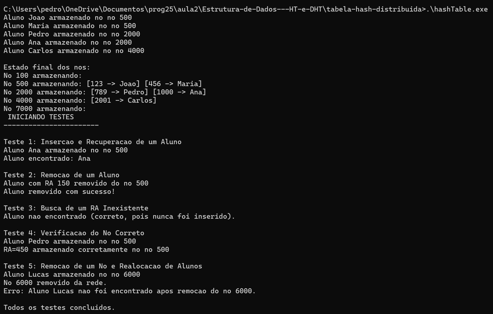

# **Documentação dos Casos de Teste da DHT**

## **1️⃣ Teste: Inserção e Recuperação de um Aluno**
### **Pré-condição**
- A DHT contém pelo menos um nó ativo.
- Nenhum aluno com o RA específico foi inserido antes.

### **Etapas do Teste**
1. Inserir um aluno com RA **150** e nome **Ana**.
2. Buscar o aluno na DHT.
3. Verificar se o aluno pode ser recuperado corretamente.

### **Pós-condição**
- O aluno deve ser armazenado no nó correto.
- A busca pelo RA **150** deve retornar o aluno **Ana** com sucesso.

#### **Saída esperada no terminal**
##### Aluno Ana armazenado no no 500 Aluno encontrado: Ana

---

## **2️⃣ Teste: Remoção de um Aluno**
### **Pré-condição**
- Um aluno com RA **150** já foi inserido na DHT.

### **Etapas do Teste**
1. Remover o aluno de RA **150**.
2. Tentar recuperar esse aluno da DHT.

### **Pós-condição**
- A remoção deve ser registrada no log.
- A busca pelo RA **150** deve retornar **"Aluno não encontrado"**.

#### **Saída esperada no terminal**
##### Aluno com RA 150 removido do no 500 Aluno removido com sucesso!

---

## **3️⃣ Teste: Busca de um RA Inexistente**
### **Pré-condição**
- Nenhum aluno com RA **9999** foi inserido na DHT.

### **Etapas do Teste**
1. Tentar recuperar um aluno com RA **9999**.
2. Verificar se o sistema retorna **"Aluno não encontrado"**.

### **Pós-condição**
- A busca deve falhar corretamente.
- O sistema deve indicar que o RA **9999** não está armazenado.

#### **Saída esperada no terminal**
##### Aluno nao encontrado (correto, pois nunca foi inserido).

---

## **4️⃣ Teste: Verificação do Nó Correto**
### **Pré-condição**
- A DHT possui nós ativos e está configurada corretamente.

### **Etapas do Teste**
1. Inserir um aluno com RA **450** e nome **Pedro**.
2. Identificar o nó onde o aluno foi armazenado.
3. Comparar com o nó esperado.

### **Pós-condição**
- O RA **450** deve ser armazenado no nó correto **(esperado: nó 500)**.
- O log deve confirmar a armazenagem no nó correto.

#### **Saída esperada no terminal**
##### Aluno Pedro armazenado no no 500 RA=450 armazenado corretamente no no 500

---

## **5️⃣ Teste: Remoção de um Nó e Realocação de Alunos**
### **Pré-condição**
- A DHT possui pelo menos dois nós.
- O nó **6000** foi adicionado à rede.
- O aluno **Lucas** foi armazenado no nó **6000**.

### **Etapas do Teste**
1. Inserir um aluno com RA **5900** e nome **Lucas**.
2. Remover o nó **6000** da DHT.
3. Buscar o aluno **Lucas** na DHT para verificar se ele foi realocado.

### **Pós-condição**
- O nó **6000** deve ser removido corretamente.
- O aluno **Lucas** deveria ser realocado para o próximo nó disponível.
- Se a realocação falhar, o sistema deve indicar que o aluno não foi encontrado.

#### **Saída esperada no terminal**
##### Aluno Lucas armazenado no no 6000 No 6000 removido da rede. Erro: Aluno Lucas nao foi encontrado apos remocao do no 6000.

## Por fim, a demonstração dos testes com um print do log do terminal:

 
 

  
